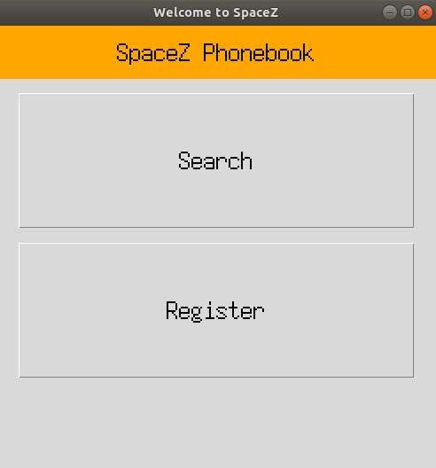
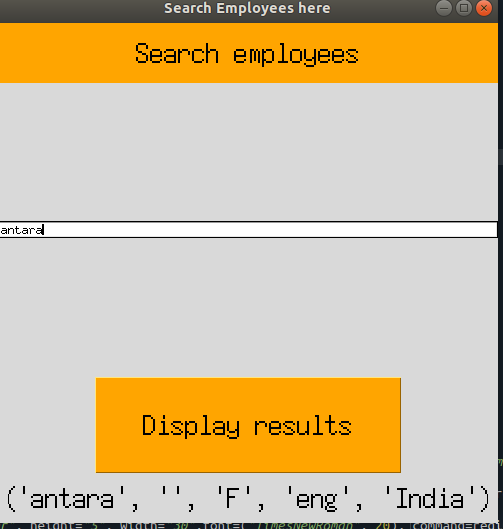
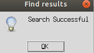
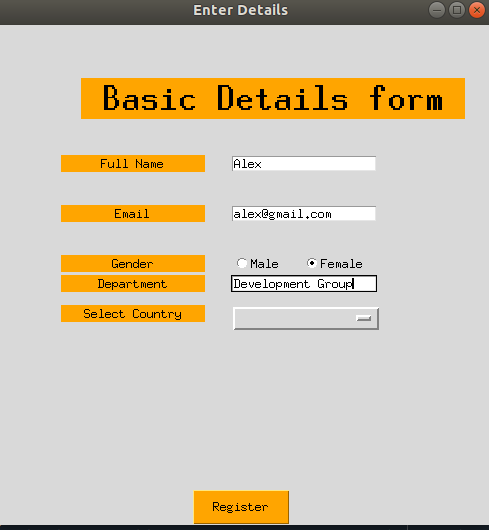
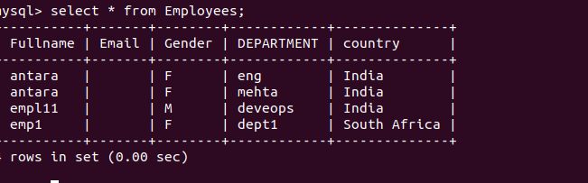

# SpaceZ Employee Phonebook
Welcome to SpaceZ.
Space Exploration Technologies Corp., trading as SpaceX, is an American aerospace manufacturer and space transportation services company headquartered in Hawthorne, California. It was founded in 2002 by Elon Musk with the goal of reducing space transportation costs to enable the colonization of Mars. 
We value our employees more than our products, hence to record all the details of our valuable employees, we have created an application to store and fetch relevant information for your needs.
Please refer to the documentation below which higlights its usage and process flow.
## Getting Started

This is a simple application with two important features: 1.Insert details 2.Fetch details about an employee using his first name.

## Built With

* [Tkinter](https://docs.python.org/3/library/tk.html) - Tkinter is the standard GUI library for Python. 
Python when combined with Tkinter provides a fast and easy way to create GUI applications. Tkinter provides a powerful object-oriented interface to the Tk GUI toolkit.

Creating a GUI application using Tkinter is an easy task. All you need to do is perform the following steps −

    Import the Tkinter module.

    Create the GUI application main window.

    Add one or more of the above-mentioned widgets to the GUI application.

    Enter the main event loop to take action against each event triggered by the user.

* [MySql](https://www.mysql.com/) - 
MySQL is a relational database management system based on SQL – Structured Query Language.
The application is used for a wide range of purposes, including data warehousing, e-commerce,
and logging applications. The most common use for mySQL however, is for the purpose of a web database.

Reason of choosing mysql over all the other relational databases is :
1. Easy to use. MySQL is easy to use. ...
2. It is secure. ...
3. Client/ Server Architecture. ...
4. Free to download. ...
5. It is scalable. ...
6. Speed. ...
7. High Flexibility. 

* [SqlAlchemmy](https://www.sqlalchemy.org/) -

SQLAlchemy is the Python SQL toolkit and Object Relational Mapper that gives application developers the full power and flexibility of SQL.

It provides a full suite of well known enterprise-level persistence patterns, designed for efficient and high-performing database access, adapted into a simple and Pythonic domain language.

SQLAlchemy is the Python SQL toolkit and Object Relational Mapper that gives application developers the full power and flexibility of SQL.

It provides a full suite of well known enterprise-level persistence patterns, designed for efficient and high-performing database access, adapted into a simple and Pythonic domain language.

## How to use
Step1: Clone the git repository .

Step2: Run the following command from the terminal.
```bash
     cd <path-to-the-directory>
     python Main.py
```

Step3: Click on Search. It opens a window where you need to include the name of the person whose information you want to see.
      OR
      Click on Register.It opens a new window where you need to enter details for the employees.
      
Step4: The database will be updated according to the instructions.

Table used Employees.
DDL For employees:
```bash
    'CREATE TABLE IF NOT EXISTS Employees (Fullname varchar(50),Email varchar(50),Gender varchar(2),Department varchar(50),country varchar(50))')
```
#  Sample Terminal Output
Database Opened And Created Successfully
Create Details Table Succesfully
name :  antara  email :  antara@gmail.com  gender :  F  department :  Engineering  Country :  India

#  Coding

To follow best practices of Software Development,we have followed the OOP concept of classes and objects.
Main.py is the main method which provokes functions from the SecondPage.py file.
I have used meaningful variables and comments throughout the code for better understanding.
Error handling has been taken care of by adding try and catch block.
Please follow the screenshots below.
Error handling has been taken care of by adding try and catch block.










